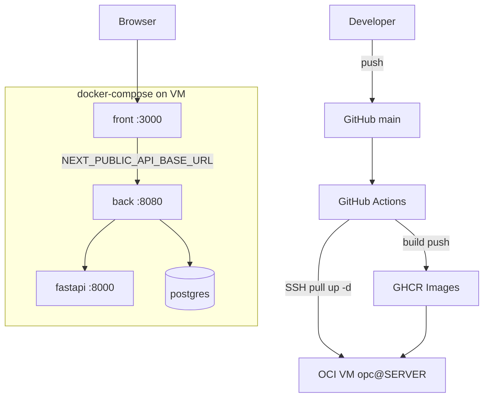

# Pivot Seoul Deployment Plan (MVP)

---

## 1. 문서 정보

| 항목 | 내용 |
| --- | --- |
| 문서명 | Pivot Seoul Deployment Plan (MVP) |
| 버전 | v0.1-mvp |
| 작성일 | 2026-07-02 |
| 작성자 | Pivot Seoul DevOps |
| 대상 릴리즈 | MVP (RIR 3기능) |
| 관련 문서 | `docs/PRD-MVP.md`, `docs/SRS-MVP.md`, `docs/SDD-MVP.md`, `docs/TEST-QAQC-MVP.md` |

---

## 2. 문서 목적

Pivot Seoul MVP(Frontend + Spring Backend + FastAPI + PostgreSQL)를 **안전하게 빌드·배포·검증·롤백**하기 위한 계획서다.

```
Test/QAQC Pass → Deployment → Operation
```

---

## 3. 배포 범위

| 구분 | 내용 |
| --- | --- |
| 배포 대상 | `front`, `back`, `fastapi`, `db`(PostgreSQL) |
| 배포 버전 | MVP v0.1.0 (`:latest` 이미지 태그) |
| 배포 환경 | Local(Docker Compose) / Production(OCI VM + GHCR) |
| 배포 방식 | GitHub Actions → GHCR push → SSH `docker-compose up -d` |
| 배포 담당자 | [담당자명] |
| 승인자 | [PM/기술리드] |

**MVP 배포 제외:** 관리자 JWT, A/B 시나리오, LLM 외부 API 키(미사용 시 N/A)

---

## 4. 시스템 구성

| 구성요소 | 기술 | 컨테이너 | 포트(호스트) |
| --- | --- | --- | --- |
| Frontend | Next.js 20 (standalone) | `pivotseoul-front` | 3000 |
| Backend | Spring Boot 17, Flyway | `pivotseoul-back` | 8080 (내부+web) |
| AI | FastAPI, uvicorn | `pivotseoul-fastapi` | 8000 (internal only) |
| Database | PostgreSQL 16 | `pivotseoul-db` | internal only |
| CI/CD | GitHub Actions | `.github/workflows/deploy.yml` | — |
| Registry | GHCR | `ghcr.io/{owner}/pivotseoul-*` | — |

---

## 5. 배포 아키텍처



**네트워크:**

- `web`: front ↔ 외부, back 노출
- `internal`: back ↔ fastapi ↔ db (FastAPI는 외부 미노출)

---

## 6. 배포 전 준비사항

| 체크 항목 | 확인 |
| --- | --- |
| `docs/TEST-QAQC-MVP.md` P0 TC Pass | □ |
| Critical/Major Bug 0건 | □ |
| `main` 브랜치 머지 완료 | □ |
| Flyway V1~V6 마이그레이션 검토 | □ |
| `.env` 서버에 준비 (`.env.example` 참고) | □ |
| `POSTGRES_PASSWORD` 강력 비밀번호 | □ |
| `PIVOT_CORS_ORIGINS` 실제 front URL | □ |
| `NEXT_PUBLIC_API_BASE_URL` 브라우저→back URL | □ |
| GitHub Secrets: `SERVER_HOST`, `SERVER_SSH_KEY` | □ |
| VM에 `~/pivotSeoul/docker-compose.yml` + `.env` | □ |
| 이전 이미지 태그 보관(롤백용) | □ |

---

## 7. 환경변수

### 7.1 서버 `.env` (docker-compose)

| 변수명 | 설명 | 예시 | 필수 |
| --- | --- | --- | --- |
| `POSTGRES_DB` | DB 이름 | `pivotseoul` | Y |
| `POSTGRES_USER` | DB 사용자 | `pivotseoul` | Y |
| `POSTGRES_PASSWORD` | DB 비밀번호 | `********` | Y |
| `PIVOT_CORS_ORIGINS` | Spring CORS | `http://1.2.3.4:3000` | Y |
| `NEXT_PUBLIC_API_BASE_URL` | 브라우저→Spring URL | `http://1.2.3.4:8080` | Y |
| `FRONT_PORT` | Front 호스트 포트 | `3000` | N |
| `BACK_IMAGE` | Back 이미지 override | GHCR URL | N |
| `FASTAPI_IMAGE` | FastAPI 이미지 override | GHCR URL | N |
| `FRONT_IMAGE` | Front 이미지 override | GHCR URL | N |

### 7.2 Spring (컨테이너 내부, compose가 주입)

| 변수명 | 설명 | MVP 값 |
| --- | --- | --- |
| `SPRING_PROFILES_ACTIVE` | 프로필 | `prod` (Dockerfile ENTRYPOINT) |
| `SPRING_DATASOURCE_URL` | JDBC | `jdbc:postgresql://db:5432/pivotseoul` |
| `SPRING_DATASOURCE_USERNAME` | DB user | compose에서 주입 |
| `SPRING_DATASOURCE_PASSWORD` | DB password | compose에서 주입 |
| `PIVOT_FASTAPI_BASE_URL` | AI 서버 | `http://fastapi:8000` |
| `PIVOT_CORS_ORIGINS` | CORS | `.env`에서 주입 |

### 7.3 GitHub Actions Secrets

| Secret | 용도 |
| --- | --- |
| `SERVER_HOST` | 배포 대상 VM IP/호스트 |
| `SERVER_SSH_KEY` | opc 사용자 SSH private key |
| `GITHUB_TOKEN` | GHCR login (자동) |

---

## 8. 배포 절차

### 8.1 자동 배포 (권장 — Production)

| Step | 작업 | 설명 |
| --- | --- | --- |
| 1 | `main`에 push | `deploy.yml` 트리거 |
| 2 | CI: 이미지 빌드·push | `pivotseoul-fastapi`, `-back`, `-front` → GHCR |
| 3 | SSH 배포 | VM에서 `docker-compose pull && up -d` |
| 4 | 배포 후 검증 | §10 체크리스트 |

### 8.2 로컬 Docker Compose (Dev/Staging)

```bash
# 레포 루트
cp .env.example .env
# .env 편집 (비밀번호, URL)

docker compose build
docker compose up -d

# 상태 확인
docker compose ps
docker compose logs -f back
```

### 8.3 Frontend 단독 빌드

```bash
cd front
npm ci
NEXT_PUBLIC_API_BASE_URL=http://localhost:8080 npm run build
npm run start   # :3000
```

### 8.4 Backend 단독 빌드

```bash
./gradlew :back:bootJar
java -jar back/build/libs/*.jar
# 또는
cd back && docker build -f Dockerfile -t pivotseoul-back:local ..
```

### 8.5 FastAPI 단독

```bash
cd fastapi
pip install -r requirements.txt
uvicorn main:app --host 0.0.0.0 --port 8000
```

### 8.6 DB (Flyway)

| Step | 작업 | 설명 |
| --- | --- | --- |
| 1 | **배포 전 DB 백업** | `pg_dump` 또는 volume 스냅샷 |
| 2 | Back 기동 | Flyway auto-migrate (`spring.flyway.enabled=true`) |
| 3 | V6 시드 확인 | `life_stage`, `threshold_type(HOUSING)` |
| 4 | 연결 확인 | back 로그에 Flyway success |

```bash
# 백업 예시
docker exec pivotseoul-db pg_dump -U pivotseoul pivotseoul > backup_$(date +%Y%m%d).sql
```

---

## 9. CI/CD Pipeline

### 9.1 현재 파이프라인 (`.github/workflows/deploy.yml`)

```
push main
  ↓
job: build-and-push
  ├─ docker build fastapi → ghcr.io/.../pivotseoul-fastapi:latest
  ├─ docker build back    → ghcr.io/.../pivotseoul-back:latest
  └─ docker build front   → ghcr.io/.../pivotseoul-front:latest
  ↓
job: deploy (needs build-and-push)
  └─ SSH → docker-compose pull && up -d
```

### 9.2 개선 권장 (MVP 이후)

- `build-and-push` 전 `./gradlew test` 추가
- pytest housing RIR 테스트 추가
- 이미지 태그 `latest` + `sha-${{ github.sha }}` 병행 (롤백용)
- 배포 후 curl 헬스체크 step

---

## 10. 배포 후 검증 (MVP)

| 검증 항목 | 방법 | 기대 결과 |
| --- | --- | --- |
| DB | `docker compose ps` | `pivotseoul-db` healthy |
| FastAPI | `docker exec` 내부 `wget -qO- http://fastapi:8000/health` | 200 |
| Spring | `curl http://HOST:8080/health` | `{"status":"ok"}` |
| AI 게이트웨이 | `curl http://HOST:8080/api/ai/status` | fastapiHealthHttpStatus 200 |
| Front | `curl -I http://HOST:3000` | 200 |
| **MVP API-1** | POST `/api/simulation/sessions` | 201 + sessionId |
| **MVP API-2** | POST `/api/simulation-sessions/{id}/run` | COMPLETED, rir |
| **MVP API-3** | GET `/api/simulation/results/{id}` | thresholds 포함 |
| E2E | 브라우저 Home→Results | Red Zone 표시 |
| CORS | Front에서 API 호출 | 브라우저 CORS 오류 없음 |
| 로그 | `docker compose logs back fastapi` | ERROR 지속 없음 |

**MVP 배포 성공 기준:** API-1~3 + E2E(TC-011) 통과

---

## 11. 롤백 계획

### 11.1 롤백 기준

| 상황 | 롤백 |
| --- | --- |
| Front/Back/FastAPI 기동 실패 | 즉시 |
| `/health` 실패 | 즉시 |
| MVP Run API 전부 FAILED | 즉시 |
| Flyway migrate 실패 | DB 복구 + 이전 back 이미지 |
| UI 문구 오타 | Hotfix (롤백 불필요) |

### 11.2 롤백 절차

```bash
# VM (~/pivotSeoul)
# 1) 이전 이미지 digest/sha 태그로 .env 수정
BACK_IMAGE=ghcr.io/owner/pivotseoul-back:sha-abc1234
FASTAPI_IMAGE=ghcr.io/owner/pivotseoul-fastapi:sha-abc1234
FRONT_IMAGE=ghcr.io/owner/pivotseoul-front:sha-abc1234

# 2) 재배포
sudo docker-compose pull
sudo docker-compose up -d

# 3) Flyway 실패 시 DB 복구
docker exec -i pivotseoul-db psql -U pivotseoul pivotseoul < backup_YYYYMMDD.sql

# 4) 검증
curl http://localhost:8080/health
```

---

## 12. 모니터링

| 항목 | MVP 방법 |
| --- | --- |
| 컨테이너 상태 | `docker compose ps`, restart policy |
| Back 헬스 | `/health` (compose healthcheck) |
| FastAPI 헬스 | `/health` (internal) |
| 에러 로그 | `docker compose logs --tail=200 back` |
| AI 연결 | `/api/ai/status` |
| 디스크 | VM `df -h`, `db_data` volume |

**v1.0+:** CloudWatch / Prometheus / Grafana 연동

---

## 13. 배포 이력

| 버전 | 배포일 | 배포자 | 변경 내용 | 결과 |
| --- | --- | --- | --- | --- |
| v0.1.0-mvp | YYYY-MM-DD | [이름] | MVP RIR 3기능 최초 배포 | Pending |

---

## 14. 장애 대응 기록

| 장애 ID | 발생일 | 증상 | 원인 | 조치 | 재발 방지 |
| --- | --- | --- | --- | --- | --- |
| INC-001 | — | — | — | — | — |

---

## 15. 배포 완료 기준

| 기준 | 완료 |
| --- | --- |
| GitHub Actions build-and-push 성공 | □ |
| deploy job SSH 성공 | □ |
| 4 컨테이너 running/healthy | □ |
| `GET /health` → ok | □ |
| MVP API 3종 Pass (§10) | □ |
| E2E TC-011 Pass | □ |
| `.env`에 secret 미커밋 확인 | □ |
| DB 백업 완료 | □ |
| 배포 이력 §13 기록 | □ |

---

## 16. 로컬 vs 운영 URL 정리

| 접근 주체 | Front | Spring API | FastAPI |
| --- | --- | --- | --- |
| 브라우저 | `http://HOST:3000` | `NEXT_PUBLIC_API_BASE_URL` | **직접 호출 금지** |
| Spring 내부 | — | — | `http://fastapi:8000` |
| 로컬 개발 | `localhost:3000` | `localhost:8080` | `localhost:8000` |

---

**MVP 배포 한 줄:** *`main` push → GHCR 3이미지 → VM compose up → `/health` + RIR Run API 확인.*
