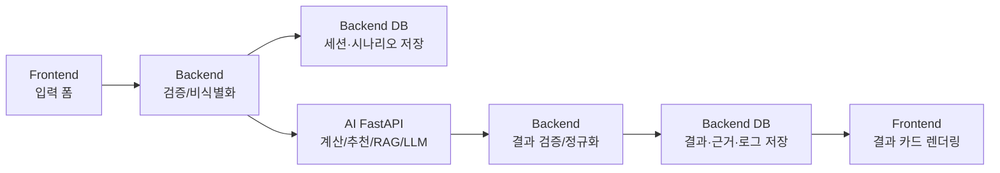

# §12 스키마 개념과 Backend/AI 스키마 분리 · §13 Backend와 AI 분리 설계

## §12.1 스키마란 무엇인가

스키마는 데이터베이스의 구조 정의다. ERD가 그림이라면 스키마는 실제 구현 규칙이다.

```text
ERD Entity: SCENARIO_RESULT
→ DB Table: scenario_result
→ Columns: scenario_result_id, simulation_run_id, scenario_id, result_status, total_score, risk_score
→ Constraints: PK, FK, NOT NULL, UNIQUE 등
```

## §12.2 Backend 스키마

Backend 스키마는 서비스 운영 DB에 해당한다. 사용자의 시뮬레이션 실행 기록, 결과, 출처, 로그를 저장한다.

| Backend 스키마 영역 | 주요 테이블 | 역할 |
| --- | --- | --- |
| simulation | `SIMULATION_SESSION`, `SCENARIO`, `SIMULATION_RUN`, `SCENARIO_RESULT` | 사용자 실행 흐름과 결과 저장 |
| threshold | `THRESHOLD_TYPE`, `THRESHOLD_RESULT`, `RED_ZONE_RULE` | 임계점 판정과 Red Zone 기준 |
| recommendation | `RECOMMENDATION_CANDIDATE`, `RECOVERY_LEVER`, `WEEKLY_ACTION` | 추천 후보와 실행 액션 저장 |
| data | `DATASET_REGISTRY`, `DATA_SOURCE`, `DATA_SNAPSHOT` | 데이터 출처와 기준일 관리 |
| audit/log | `LLM_EXPLANATION_LOG`, `CALCULATION_AUDIT_LOG`, `AI_ANOMALY_LOG` | AI 안전성, 계산 검증, 오류 추적 |

## §12.3 AI 코드/DTO 스키마

AI도 기능별로 나누는 것이 맞다. 다만 여기서 말하는 AI 스키마는 **FastAPI 전용 운영 DB 스키마가 아니라 코드 구조와 DTO 계약**을 뜻한다.

현재 구조는 `Spring → FastAPI → Spring DTO` 흐름이므로, MVP 단계에서는 FastAPI가 별도 `AI DB`를 직접 소유하지 않는다. FastAPI는 비식별 Scenario DTO를 받아 계산·추천·RAG·LLM 해설을 수행하고, 결과 DTO를 Spring Backend로 반환한다. 최종 저장은 Spring Backend DB가 담당한다.

핵심 규칙은 다음과 같다.

```text
modules/{feature}_router.py
modules/{feature}_service.py
modules/{feature}_schema.py
pipelines/{feature}_{step}.py
```

서비스 특성상 단순 CRUD가 아니라 기능별 계산·추천·RAG·LLM이 결합된다. 그래서 최상위를 `rag`, `threshold`, `calculator` 같은 기술 기준으로 나누지 않고, `housing`, `career`, `childcare`, `senior`, `policy`, `simulation`, `llm_explanation`, `data_source` 같은 기능 기준으로 고정한다.

| AI 구조 영역 | 파일 패턴 | 역할 |
| --- | --- | --- |
| 앱 진입 | `main.py` | FastAPI 앱 생성, CORS 설정, v1 라우터 등록 |
| 라우터 통합 | `api_router.py` | 기능 모듈 라우터를 한 곳에서 통합 |
| 기능 모듈 | `modules/{feature}_router.py`, `modules/{feature}_service.py`, `modules/{feature}_schema.py` | 기능별 HTTP endpoint, 유스케이스 실행, API 입출력 DTO 관리 |
| 기술 단계 | `pipelines/{feature}_preprocessing.py`, `pipelines/{feature}_threshold_calculator.py` | 기능 내부의 전처리, Feature 생성, 계산, 추천, RAG, LLM 단계 |
| 데이터 파일 | `data/*`, `data/MIGRATION_MAP.csv` | 평탄화된 공공데이터, Feature 파일, 원본 경로 매핑 |
| 모델 산출물 | `artifacts/*` | 모델 파일, 임베딩, 벡터 인덱스 저장 |
| 운영 저장소 | Spring Backend DB | 세션, 시나리오, 계산 결과, 추천, 근거, 로그의 단일 진실 공급원 |

이 구조의 핵심은 **FastAPI를 stateless 계산 서버로 유지하고, 운영 저장 책임은 Spring에 집중하는 것**이다.

## §13.1 분리하는 것이 좋은 이유

이 프로젝트는 Backend와 AI를 분리하는 것이 좋다. Backend는 사용자 요청을 안정적으로 처리하고 결과를 저장해야 하며, AI는 계산·추천·RAG·LLM처럼 변경이 잦은 로직을 처리해야 한다.

| 구분 | Backend | AI |
| --- | --- | --- |
| 역할 | 서비스 API, DB 저장, 비식별화, 결과 검증, 출처 관리 | Feature 생성, 임계점 계산, 추천 후보 생성, RAG, LLM 해설 |
| 저장 대상 | 정식 서비스 결과와 로그 | Feature, 모델, 임베딩, 벡터 인덱스 |
| 배포 주기 | 안정적이고 보수적으로 배포 | 모델·프롬프트 개선에 따라 자주 배포 |
| 보안 | 원본 입력 검증, 구간화, 개인정보 보호 | 비식별 데이터만 받아 계산 |
| 장애 대응 | fallback 응답, 캐시, 오류 로그 | 실패 사유와 안전성 점수를 반환 |

## §13.2 기능별 책임 분리

Backend와 AI는 둘 다 기능 중심으로 나누되, **폴더 기준과 책임 기준이 다르다.**

- Backend는 `com.pivotseoul.domain.{domain}` 아래에서 **저장·조회·API 계약·운영 로그**를 담당한다.
- AI는 FastAPI 서비스 안에서 **기능별 계산·추천·RAG·LLM pipeline**을 담당한다.
- Backend의 `domain/ai`는 실제 AI 계산 구현체가 아니라 **Spring-side AI gateway/orchestration**이다. 즉 FastAPI AI 서버와 외부 LLM을 호출하는 경계 역할만 한다.

| 기능 | Backend 책임 | AI 파일 | AI 책임 |
| --- | --- | --- | --- |
| 공통 시뮬레이션 | 세션 생성, 시나리오 저장, 실행 상태 관리 | `simulation_service.py`, `simulation_flow.py`, `simulation_result_builder.py` | 기능별 계산 결과를 모아 A/B 비교 결과 생성 |
| 주거 | 주거 결과와 출처 저장 | `housing_service.py`, `housing_preprocessing.py`, `housing_threshold_calculator.py` | RIR, 주거비 부담, 공공임대 기회 점수 계산 |
| 커리어 | 추천 후보와 액션 저장 | `career_service.py`, `career_text_feature_builder.py`, `career_sentence_bert_matcher.py` | 직무-교육 유사도, 커리어 임계점, 교육/일자리 추천 계산 |
| 보육/복직 | 시설/정책 추천과 회복 레버 저장 | `childcare_service.py`, `childcare_capacity_calculator.py`, `childcare_gis_access_analyzer.py` | 보육 공급 점수, 시설 접근성, 복직 순이익 계산 |
| 노년 | 노후 결과와 외부 링크 저장 | `senior_service.py`, `senior_asset_life_calculator.py`, `senior_facility_matcher.py` | 자산수명, 다운사이징, 복지시설 접근성 계산 |
| 정책/RAG | 근거 chunk와 추천 후보 저장 | `policy_service.py`, `policy_condition_matcher.py`, `policy_rag_retriever.py` | 정책 문서 검색, 유사도 계산, 근거 정렬, 정책 추천 |
| LLM 해설 | 해설 로그와 안전성 검증값 저장 | `llm_explanation_service.py`, `llm_explanation_prompt_builder.py`, `llm_explanation_guardrails.py` | 계산 결과 기반 설명 생성, 환각 방지 검사 |
| 데이터 소스 | 데이터셋, 기준일, 스냅샷 메타데이터 저장 | `data_source_service.py`, `data_source_loader.py`, `data_source_common_preprocessor.py` | 공공데이터 로딩, 컬럼 매핑, 공통 전처리, Feature 입력 생성 |

## §13.3 권장 데이터 흐름



## §13.4 중요한 원칙

- MVP에서는 FastAPI 전용 `AI DB`를 두지 않는다.
- AI는 운영 DB에 직접 쓰지 않는다.
- AI는 계산 결과 DTO를 Backend에 반환한다.
- Backend는 결과를 검증하고 정규화한 뒤 Spring DB에 저장한다.
- Spring DB가 세션, 시나리오, 계산 결과, 추천, 근거, 로그의 단일 진실 공급원이다.
- Backend는 원본 민감정보를 AI에 넘기지 않는다.
- LLM에는 계산 결과, 추천 후보, 검색 근거만 전달한다.
- 결과 화면은 Backend DB에 저장된 검증 완료 결과만 사용한다.
- 추후 AI 실험 로그, 모델 성능 평가, 온라인 RAG 문서 관리, 비동기 배치 상태 관리가 필요해질 때만 별도 AI DB 또는 Vector DB를 검토한다.

[← 목차로](./README.md)
