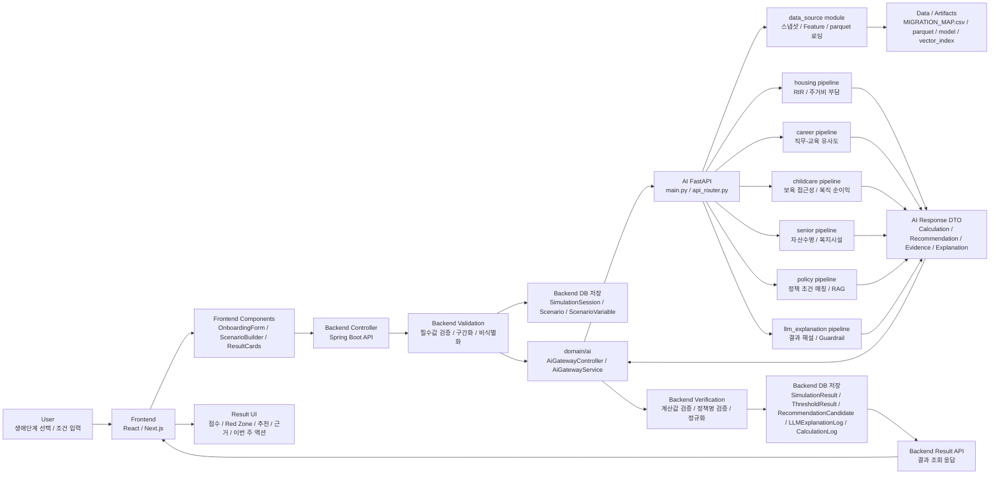
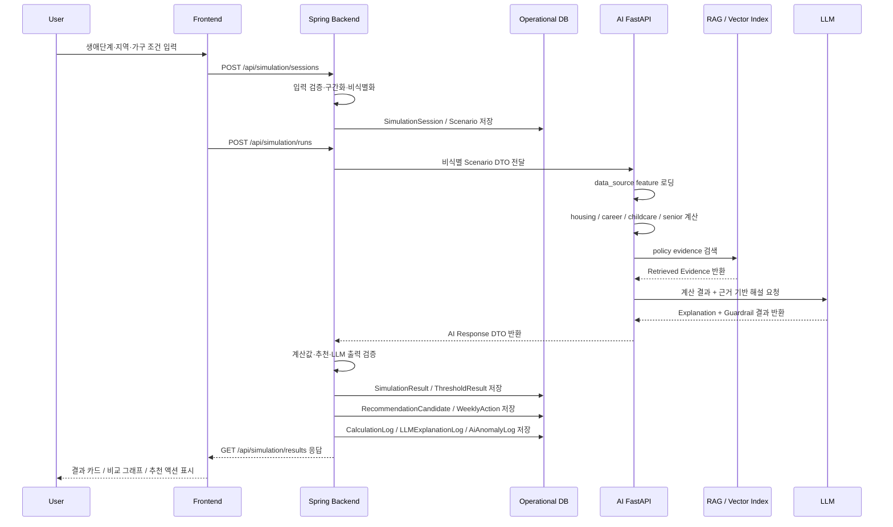

# §16 Front → Backend → AI 전체 흐름도

## §16.1 전체 아키텍처 그림

아래 그림은 사용자가 Frontend에서 입력한 뒤, Backend가 검증·저장·오케스트레이션을 수행하고, AI가 계산·추천·RAG·LLM 해설을 만든 뒤 다시 Backend를 통해 결과 화면으로 돌아오는 전체 흐름이다.

## §16.2 요청-응답 시퀀스 그림

## §16.3 단계별 책임 정리

| 단계 | 담당 | 주요 처리 | 저장/산출물 |
| --- | --- | --- | --- |
| 1. 입력 | Frontend | 생애단계, 지역, 가구 조건, 목표 직무, 자녀 여부 등 입력 | Request DTO |
| 2. 검증 | Backend | 필수값 검증, 값 범위 검증, 원본 입력 구간화, 비식별화 | `SimulationSession`, `Scenario`, `ScenarioVariable` |
| 3. AI 호출 | Backend `domain/ai` | FastAPI AI 서버로 비식별 Scenario DTO 전달 | AI Request DTO |
| 4. 데이터 로딩 | AI `data_source` | 스냅샷, Feature, parquet, vector index 로딩 | `FeatureSet`, `MIGRATION_MAP.csv` |
| 5. 기능별 계산 | AI pipelines | 주거·커리어·보육·노년·정책 pipeline 실행 | `AI_CALCULATION_RESULT`, `AI_RECOMMENDATION_RESULT` |
| 6. RAG 검색 | AI `policy` | 정책·교육·시설 근거 chunk 검색 | `RAG_RETRIEVAL_RESULT` |
| 7. LLM 해설 | AI `llm_explanation` | 계산 결과와 근거 기반 해설 생성, 환각 방지 검사 | `LLM_EXPLANATION_RESULT` |
| 8. 결과 검증 | Backend | AI 결과 DTO 검증, 숫자/정책명/근거 정합성 확인 | `CalculationLog`, `AiAnomalyLog` |
| 9. 결과 저장 | Backend DB | 검증 완료 결과, 추천, 근거, 해설, 로그 저장 | `SimulationResult`, `ThresholdResult`, `RecommendationCandidate`, `LLMExplanationLog` |
| 10. 화면 출력 | Frontend | 결과 카드, Red Zone, A/B 비교, 추천 액션, 근거 패널 렌더링 | Result UI |

## §16.4 핵심 원칙

1. Frontend는 입력과 결과 표시를 담당한다.
2. Backend는 운영 DB의 단일 진실 공급원이다.
3. FastAPI는 MVP 단계에서 별도 AI DB를 소유하지 않는다.
4. AI는 계산·추천·RAG·LLM을 수행하지만 운영 DB에 직접 쓰지 않는다.
5. AI 결과는 반드시 Backend 검증을 거친 뒤 Spring DB에 저장한다.
6. LLM은 숫자를 새로 만들지 않고, 계산 결과와 검색 근거를 설명만 한다.
7. 사용자가 보는 결과는 AI 원본 응답이 아니라 Backend가 검증·정규화·저장한 결과다.
8. 별도 AI DB 또는 Vector DB는 실험 로그, 모델 평가, 온라인 RAG 문서 관리, 비동기 배치 상태 관리가 실제 요구사항이 될 때 도입한다.

[← 목차로](./README.md)
